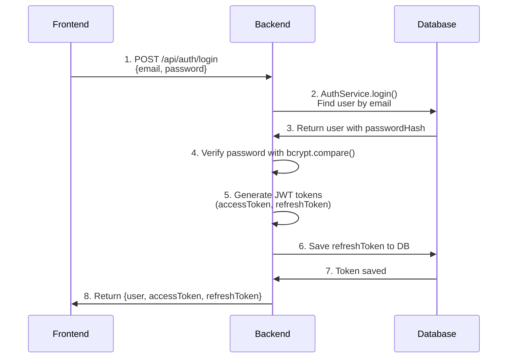
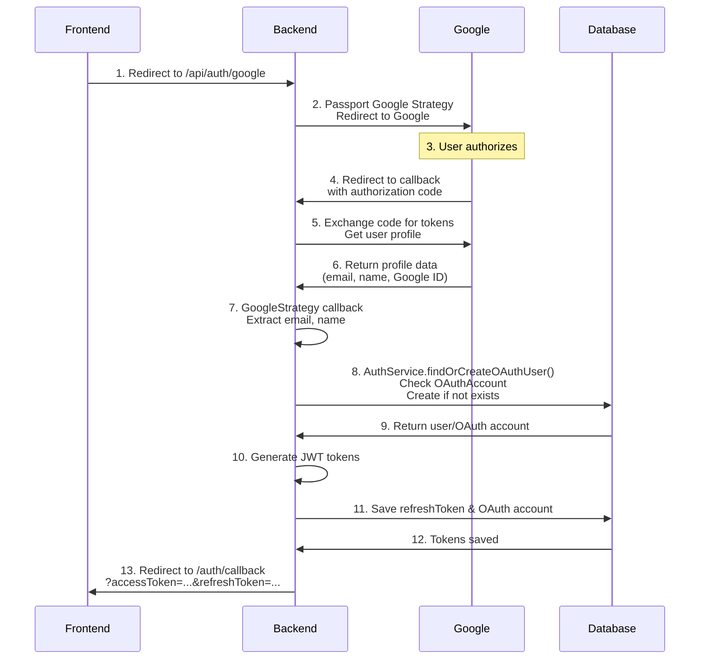

# Jam Band — Backend

A TypeScript Express.js backend for the Jam Band application with **dual room architecture**:
- **Perform Rooms**: Real-time jamming sessions with ultra-low latency audio sync
- **Arrange Rooms**: Collaborative DAW for multi-user music production with real-time timeline editing

Provides REST endpoints, WebSocket/Socket.IO handlers for real-time features, and WebRTC signaling support for voice communication.

## Quick overview

- **Language**: TypeScript
- **Framework**: Express (HTTP) + Socket.IO for real-time features
- **Runtime**: Node.js 18+ (Bun compatible)
- **Architecture**: Domain-Driven Design (DDD) with modular bounded contexts
- **Room Types**: 
  - **Perform Room**: Live jamming with ephemeral sessions
  - **Arrange Room**: Collaborative DAW with real-time multi-track production
- **Purpose**: Room management, real-time collaboration, WebRTC voice, and audio processing

## Requirements

- Node.js v18+ or Bun runtime
- Package manager: npm, yarn, or bun
- For HTTPS development: mkcert (recommended) or OpenSSL

## Getting started (local development)

1. Install dependencies

```bash
npm install
# or with Bun:
bun install
```

2. Copy the environment example and edit values

```bash
cp env.local.example .env.local
```

3. Start the development server (hot reload)

```bash
npm run start:dev
# or with TypeScript watch mode:
npm run start:dev:gc  # with garbage collection monitoring
```

By default the server listens on http://localhost:3001 (see `PORT` env var).

### HTTPS Development Setup

For WebRTC testing, HTTPS is required:

```bash
# Generate SSL certificates (requires mkcert)
bun run scripts/generate-ssl.js

# Or validate existing HTTPS setup
bun run test:https:validate
```

## Available scripts

### Development
- `npm run start:dev` — Start development server with hot reload (tsx)
- `npm run start:dev:gc` — Development with garbage collection monitoring
- `npm run build` — Build the project for production
- `npm run start` — Start the production server
- `npm run start:prod` — Production server with optimized memory settings

### Testing

#### New Comprehensive Testing Framework (42 tests total)
- `npm test -- tests/` — Run all new framework tests (RECOMMENDED)
- `npm run test:regression` — **CRITICAL**: Run 14 regression tests (use before/after adding features)
- `npm run test:unit` — Run 7 unit tests for isolated components
- `npm run test:integration` — Run 17 integration tests for complete workflows
- `npm run test:e2e` — Run 4 end-to-end tests for API/WebSocket validation
- `npm run test:watch` — Run tests in watch mode
- `npm run test:coverage` — Generate test coverage reports
- `npm run test:ci` — Run tests for CI/CD

#### Legacy Testing
- `npm run test` — Run all tests (includes legacy tests with many failures)
- `npm run test:webrtc` — WebRTC functionality tests
- `npm run test:https` — HTTPS/TLS configuration tests
- `npm run test:load` — Load testing and performance tests
- `npm run test:performance` — Performance monitoring tests

**IMPORTANT**: Use `npm test` (Jest) not `bun test` for the testing framework to work properly.

### Quality & Maintenance
- `npm run lint` — Run ESLint
- `npm run lint:fix` — Fix linting issues automatically
- `npm run clean` — Remove build artifacts
- `npm run type-check` — Run TypeScript type checks

### Deployment
- `npm run docker:build` — Build Docker image
- `npm run docker:run` — Run Docker container
- `npm run railway:deploy` — Deploy to Railway
- `npm run railway:logs` — View Railway deployment logs

Check `package.json` for exact script definitions.

## Environment variables

Important variables (see `env.local.example` and `env.production.example`):

### Core Configuration
- `PORT` — Server port (default: 3001)
- `NODE_ENV` — `development` or `production`
- `LOG_LEVEL` — Logging level (`info`, `warn`, `error`)

### Security & CORS
- `JWT_SECRET` — Secret key for JWT tokens
- `FRONTEND_URL` — Frontend origin for CORS
- `CORS_STRICT_MODE` — Enable strict CORS validation
- `RATE_LIMIT_WINDOW_MS` — Rate limiting window
- `RATE_LIMIT_MAX_REQUESTS` — Max requests per window

### WebRTC & Voice
- `WEBRTC_ENABLED` — Enable WebRTC functionality
- `WEBRTC_REQUIRE_HTTPS` — Require HTTPS for WebRTC (production)
- `WEBRTC_STUN_SERVERS` — STUN server configuration
- `DISABLE_VOICE_RATE_LIMIT` — Disable voice rate limiting (dev only)
- `VOICE_OFFER_RATE_LIMIT`, `VOICE_ANSWER_RATE_LIMIT`, `VOICE_ICE_RATE_LIMIT` — Voice signaling limits

### SSL/TLS (Development & Production)
- `USE_SSL` / `SSL_ENABLED` — Enable HTTPS
- `SSL_KEY_PATH`, `SSL_CERT_PATH` — SSL certificate paths

### Performance
- `ENABLE_PERFORMANCE_MONITORING` — Enable performance tracking
- `DISABLE_SYNTH_RATE_LIMIT` — Disable synthesizer rate limiting

### Arrange Room (Collaborative DAW)
- `AUDIO_STORAGE_PATH` — File storage path for recorded audio regions
- `MAX_AUDIO_FILE_SIZE_MB` — Maximum audio file size limit
- `PROJECT_STORAGE_PATH` — File storage path for project files
- `MAX_PROJECT_SIZE_MB` — Maximum project file size limit

### Authentication & OAuth
- `JWT_SECRET` — Secret key for signing JWT tokens
- `GOOGLE_CLIENT_ID` — Google OAuth client ID
- `GOOGLE_CLIENT_SECRET` — Google OAuth client secret
- `BACKEND_URL` — Backend URL for OAuth callback (e.g., `http://localhost:3001`)
- `FRONTEND_URL` — Frontend URL for OAuth redirect (e.g., `http://localhost:5173`)
- `EMAIL_VERIFICATION_EXPIRES_HOURS` — Email verification token expiration (default: 24)

Always store production secrets securely and do not commit `.env` files to source control.

## Room Architecture 🏗️

### Perform Room (Live Jamming)
- **Live Jamming**: Real-time instrument synchronization across users
- **Ephemeral Sessions**: Temporary rooms focused on live performance
- **WebRTC Voice**: Ultra-low latency voice chat optimized for musical timing
- **Real-time Sync**: Metronome, instruments, effects synchronized via Socket.IO
- **Session Management**: User presence, instrument swapping, room ownership
- **Step Sequencer**: Collaborative pattern creation and sharing

### Arrange Room (Collaborative DAW)
- **🎛️ Multi-track Production**: Real-time collaborative timeline editing with multiple tracks
- **🎹 MIDI Recording**: Record and edit MIDI notes with piano roll interface
- **🎙️ Audio Recording**: Record audio regions with waveform visualization and storage
- **🎚️ Track Management**: Create, reorder, and configure tracks with instrument selection
- **🔊 Synthesizer Integration**: Per-track synthesizer parameters with real-time sync
- **🎛️ Effect Chains**: Collaborative effect chain management per track
- **🔒 Collaborative Locking**: Smart locking system to prevent editing conflicts
- **👥 Presence Tracking**: Real-time user selection and activity indicators
- **💾 Project Persistence**: Save and load complete project state with all tracks and regions
- **📊 State Synchronization**: Real-time sync of all DAW operations across users
- **🎤 Voice Integration**: WebRTC voice chat during production sessions

#### Arrange Room Domain Structure
```typescript
src/domains/arrange-room/
├── domain/
│   └── models/         # Track, Region, Note, ArrangeRoomState
├── infrastructure/
│   ├── handlers/       # ArrangeRoomHandler for Socket.IO events
│   └── controllers/    # HTTP endpoints for arrange rooms
└── services/           # ArrangeRoomStateService for state management
```

#### Arrange Room State Management
- **In-Memory State**: Real-time track, region, and note state per room
- **File Storage**: Audio region files stored on disk with metadata
- **Collaborative Locks**: Per-element locking to prevent conflicts
- **State Synchronization**: Late-joiner support with full state sync

## 🔐 Authentication Flow

The backend supports two authentication methods: **Email/Password Login** and **Google OAuth**. Authentication is handled by the `auth` domain using Passport.js strategies.

### Email/Password Login Flow



**Steps:**
1. Frontend sends `POST /api/auth/login` with email and password
2. `AuthController.login()` calls `AuthService.login()`
3. `AuthService` queries database for user by email
4. Password is verified using `bcrypt.compare()`
5. JWT tokens are generated using `TokenService`:
   - `accessToken`: Short-lived token (default: 15 minutes)
   - `refreshToken`: Long-lived token (default: 7 days)
6. Refresh token is saved to database (`RefreshToken` table)
7. Backend returns user data and both tokens to frontend

**Endpoints:**
- `POST /api/auth/login` — Email/password login
- `POST /api/auth/refresh-token` — Refresh access token using refresh token
- `POST /api/auth/logout` — Revoke refresh tokens and logout

### Google OAuth Login Flow



**Steps:**
1. Frontend redirects browser to `GET /api/auth/google`
2. Backend uses Passport Google Strategy to redirect to Google OAuth consent screen
3. User authorizes the application on Google
4. Google redirects to `{BACKEND_URL}/api/auth/google/callback` with authorization code
5. Backend exchanges authorization code for access token and fetches user profile from Google
6. Google returns user profile (email, name, Google ID)
7. `GoogleStrategy` callback executes:
   - Extracts email and name from Google profile
   - Calls `AuthService.findOrCreateOAuthUser('google', providerId, email, name)`
8. `AuthService` checks if OAuth account exists:
   - If exists: Returns existing user
   - If not: Creates new user and OAuth account record
9. JWT tokens are generated and refresh token is saved to database
10. OAuth account and refresh token are persisted
11. Tokens are attached to user object
12. Backend redirects to `{FRONTEND_URL}/auth/callback?accessToken=...&refreshToken=...`
13. Frontend receives tokens in URL query parameters

**Endpoints:**
- `GET /api/auth/google` — Initiate Google OAuth flow
- `GET /api/auth/google/callback` — Handle Google OAuth callback

**OAuth Configuration:**
- Uses `passport-google-oauth20` strategy
- Requires `GOOGLE_CLIENT_ID` and `GOOGLE_CLIENT_SECRET` environment variables
- Callback URL must be registered in Google Cloud Console: `{BACKEND_URL}/api/auth/google/callback`
- See `GOOGLE_OAUTH_SETUP.md` for detailed setup instructions

### Authentication Architecture

**Domain Structure:**
```
src/domains/auth/
├── domain/
│   ├── models/              # User, OAuthAccount, RefreshToken models
│   └── services/            # AuthService (business logic)
├── infrastructure/
│   ├── controllers/         # AuthController (HTTP handlers)
│   ├── middleware/          # authMiddleware (JWT validation)
│   ├── repositories/        # UserRepository (database access)
│   ├── strategies/          # Passport strategies (local, google)
│   └── services/            # EmailService, TokenService
└── routes/                  # Express routes (auth.ts)
```

**Key Components:**
- **AuthService**: Core authentication business logic
  - `register()`: Create new user with email verification
  - `login()`: Validate credentials and generate tokens
  - `findOrCreateOAuthUser()`: Handle OAuth user creation/lookup
  - `refreshAccessToken()`: Generate new access token from refresh token
  - `verifyEmail()`: Verify email address with token
  - `requestPasswordReset()`: Generate password reset token
  - `resetPassword()`: Reset password with token

- **TokenService**: JWT token generation and validation
  - `generateAccessToken()`: Short-lived access token
  - `generateRefreshToken()`: Long-lived refresh token
  - `verifyToken()`: Validate and decode JWT tokens

- **AuthController**: HTTP request handlers
  - Validates request data
  - Calls AuthService methods
  - Returns JSON responses

- **authMiddleware**: JWT authentication middleware
  - Validates access token from `Authorization` header
  - Attaches user to `req.user` for protected routes

**Database Models:**
- **User**: Main user table with email, passwordHash, userType
- **OAuthAccount**: Links users to OAuth providers (Google, etc.)
- **RefreshToken**: Stores refresh tokens for token rotation
- **EmailVerification**: Email verification tokens
- **PasswordReset**: Password reset tokens

### Security Features

- **Password Hashing**: Uses `bcrypt` with salt rounds (10)
- **JWT Tokens**: Signed with `JWT_SECRET`, includes expiration
- **Token Rotation**: Refresh tokens can be rotated on each use
- **Email Verification**: Required for new registrations
- **Password Reset**: Secure token-based password reset flow
- **OAuth Account Linking**: Multiple OAuth providers per user account

## API endpoints

The backend exposes REST endpoints and real-time Socket.IO handlers:

### HTTP REST API
- `GET /health` — Health check with environment info
- `GET /health/simple` — Simple health check
- `GET /rooms` — List active rooms
- `POST /rooms` — Create new room (with validation)
- `POST /rooms/:roomId/leave` — Leave room
- `PUT /rooms/:roomId/settings` — Update room settings
- `GET /performance/*` — Performance monitoring endpoints

### Real-time Events (Socket.IO)

#### Perform Room Events
- **Room Management**: `join_room`, `leave_room`, `room_created`, etc.
- **Voice/WebRTC**: `voice_offer`, `voice_answer`, `ice_candidate`
- **Chat**: `send_message`, `receive_message`
- **Audio**: `note_played`, `metronome_sync`
- **Instruments**: `instrument_swap`, `instrument_mute`
- **Sequencer**: `sequencer_pattern_update`, `sequencer_sync`

#### Arrange Room Events
- **State Management**: `arrange:request_state`, `arrange:state_sync`
- **Track Operations**: `arrange:track_add`, `arrange:track_update`, `arrange:track_delete`, `arrange:track_reorder`
- **Region Operations**: `arrange:region_add`, `arrange:region_update`, `arrange:region_move`, `arrange:region_delete`
- **Note Operations**: `arrange:note_add`, `arrange:note_update`, `arrange:note_delete`
- **Recording**: `arrange:recording_preview`, `arrange:recording_preview_end`
- **Collaboration**: `arrange:lock_acquire`, `arrange:lock_release`, `arrange:selection_change`
- **Mixing**: `arrange:synth_param_update`, `arrange:effect_chain_update`
- **Project**: `arrange:bpm_change`, `arrange:time_signature_change`

See `src/domains/arrange-room/infrastructure/handlers/` for complete event specifications.

## WebRTC / Voice rate limiting

To protect signaling and voice traffic the app applies per-user rate limits:

- voice_offer: default 60/min (≈1/sec)
- voice_answer: default 60/min (≈1/sec)
- voice_ice_candidate: default 200/min (≈3.3/sec)

Recovery and safety:

- Exponential backoff for reconnection attempts (2s, 4s, 8s)
- Temporary extra attempts for users who recently hit limits
- Development bypass via `DISABLE_VOICE_RATE_LIMIT=true`

Adjust limits carefully — raising them can increase server and network load.

## WebRTC configuration

Default STUN servers configured:

- stun:stun.l.google.com:19302
- stun:stun1.l.google.com:19302
- stun:stun2.l.google.com:19302

For production, add TURN servers for reliable connectivity behind restrictive NATs/firewalls.

## Testing & Quality Assurance

### New Comprehensive Testing Framework ✅
**42 tests total** - Use `npm test -- tests/` to run the new framework

- **Regression Tests (14)**: **CRITICAL** - Detect when new features break existing functionality
- **Integration Tests (17)**: Complete room lifecycle and WebRTC workflows  
- **Unit Tests (7)**: Isolated component testing with proper mocking
- **End-to-End Tests (4)**: API endpoints and WebSocket integration

### Framework Features
- **Anti-Regression Protection**: Run `npm run test:regression` before/after adding features
- **Comprehensive Coverage**: Room management, user workflows, effect chains, performance benchmarks
- **Advanced Test Utilities**: TestEnvironment, MockFactory, TestLogger, performance measurement
- **Proper Cleanup**: No test interference, isolated test environments
- **TypeScript Integration**: Full type safety with Jest and ts-jest

### Legacy Testing
- **Performance Tests**: Load testing with concurrent users
- **HTTPS Tests**: WebRTC over TLS validation  
- **Edge Case Tests**: Boundary conditions and error scenarios
- **WebRTC Integration**: Voice communication and signaling tests

### Performance Monitoring
- Real-time performance metrics collection
- Automated regression detection built into tests
- Memory usage and connection health monitoring
- Performance optimization recommendations
- Load testing with up to 100 concurrent users

### Development Tools
- **ESLint** with TypeScript rules
- **Jest** with comprehensive test framework (use `npm test` not `bun test`)
- **TypeScript** strict mode
- **Hot reload** development server
- **SSL certificate** generation scripts

## Troubleshooting

### Common Issues
- **Rate limit exceeded** — Wait or set `DISABLE_VOICE_RATE_LIMIT=true` for development
- **HTTPS required** — Use `bun run test:https:validate` to check SSL setup
- **WebRTC connection fails** — Ensure both frontend and backend use HTTPS
- **Audio not heard** — Check browser permissions and WebRTC signaling logs
- **Memory leaks** — Monitor with `npm run start:dev:gc`
- **Performance issues** — Run `npm run test:performance` for analysis

### Debug Commands
```bash
npm run test:https:validate     # Validate HTTPS configuration
npm run test:load              # Run load tests
npm run test:performance       # Performance monitoring
bun run scripts/validate-https-setup.ts  # Comprehensive HTTPS check
```

## Project layout

```
src/
├── index.ts                    # Application bootstrap
├── config/                     # Environment and configuration
├── middleware/                 # Express middleware (CORS, security, rate limiting)
├── routes/                     # HTTP REST endpoints
├── services/                   # Core business services
├── handlers/                   # Legacy socket handlers
├── domains/                    # Domain-Driven Design modules
│   ├── audio-processing/       # Audio effects and note handling
│   ├── lobby-management/       # Lobby and room discovery
│   ├── real-time-communication/# Chat and WebRTC signaling
│   ├── room-management/        # Room lifecycle and membership (Perform Rooms)
│   ├── user-management/        # User approval and authentication
│   └── arrange-room/           # Collaborative DAW domain (Arrange Rooms)
│       ├── domain/
│       │   └── models/         # Track, Region, Note, ArrangeRoomState
│       ├── infrastructure/
│       │   ├── handlers/       # ArrangeRoomHandler for Socket.IO events
│       │   └── controllers/    # HTTP endpoints for arrange rooms
│       └── services/           # State management services
├── shared/                     # Shared infrastructure
│   ├── infrastructure/         # DI container, monitoring, caching
│   └── domain/                 # Common domain models
├── testing/                    # Test utilities and infrastructure
├── utils/                      # Common utilities
├── types/                      # TypeScript type definitions (includes room types)
└── validation/                 # Request validation schemas

scripts/                        # Development and testing scripts
tests/                          # 🚀 NEW: Comprehensive testing framework (42 tests)
├── setup.ts                    # Global Jest test configuration
├── helpers/                    # TestEnvironment, MockFactory, TestLogger
├── fixtures/                   # Standardized test data and factories
├── utils/                      # Advanced testing utilities (performance, validation)
├── unit/                       # Unit tests (7 tests)
├── integration/                # Integration tests (17 tests)
├── e2e/                       # End-to-end tests (4 tests)
├── regression/                # **CRITICAL** regression tests (14 tests)
└── README.md                  # Complete testing documentation
logs/                           # Runtime logs (development)
COLLABORATIVE_DAW_BACKEND_PLAN.md # 📋 Detailed architecture plan for Produce Rooms
```

## Logs

Runtime logs are written to the `logs/` folder. Check `error-*.log` and `combined-*.log` for recent errors and access logs.

## Deployment

### Railway (Recommended)
```bash
npm run railway:deploy      # Deploy to Railway
npm run railway:logs        # View logs
npm run railway:status      # Check deployment status
```

### Docker
```bash
npm run docker:build        # Build container
npm run docker:run          # Run locally
```

### Production Checklist
- ✅ Set `NODE_ENV=production`
- ✅ Configure HTTPS/TLS (required for WebRTC)
- ✅ Set secure `JWT_SECRET`
- ✅ Configure CORS with your frontend URL
- ✅ Add TURN servers for WebRTC (production)
- ✅ Enable rate limiting (`DISABLE_*_RATE_LIMIT=false`)
- ✅ Set appropriate `LOG_LEVEL` (warn/error)
- ✅ Configure SSL certificates or use TLS-terminating proxy

## Implementation Roadmap 🗺️

### Phase 1: Foundation ✅
- ✅ **Room Types**: Support for `'perform' | 'arrange'` room types
- ✅ **Domain Architecture**: DDD structure with separate domains
- ✅ **Real-time Infrastructure**: Socket.IO namespaces for room isolation  
- ✅ **Session Management**: User presence and room lifecycle management
- ✅ **WebRTC Integration**: Voice chat with rate limiting and optimization

### Phase 2: Arrange Room (Collaborative DAW) ✅
- ✅ **Track Management**: Create, update, delete, and reorder tracks
- ✅ **Region Operations**: Add, move, resize, and delete audio/MIDI regions
- ✅ **MIDI Editing**: Note-level editing with piano roll support
- ✅ **Audio Recording**: Record and store audio regions with waveform data
- ✅ **Real-time Sync**: All DAW operations synchronized via Socket.IO
- ✅ **Collaborative Locking**: Element-level locks to prevent conflicts
- ✅ **State Management**: In-memory state with late-joiner support
- ✅ **Project Persistence**: Save and load complete project state
- ✅ **Synthesizer Integration**: Per-track synth parameters
- ✅ **Effect Chains**: Collaborative effect management

### Phase 3: Advanced Features (Future)
- [ ] **Database Integration**: PostgreSQL for persistent project storage
- [ ] **Operational Transform**: Advanced conflict resolution algorithms
- [ ] **Version History**: Project snapshots and change tracking
- [ ] **Audio Processing**: Server-side audio rendering and mixing
- [ ] **Project Export**: Export to standard DAW formats (MIDI, WAV, etc.)
- [ ] **Cloud Storage**: S3/cloud storage for audio files
- [ ] **Real-time Analytics**: Performance monitoring and usage metrics

## Contributing

### **CRITICAL: New Feature Development Workflow** 🚨

1. **Before implementing any new feature:**
   ```bash
   npm run test:regression  # Ensure all 14 regression tests pass
   ```

2. Implement your feature following the architecture guidelines

3. **After implementing your feature:**
   ```bash
   npm run test:regression  # Verify no existing functionality broke
   npm test -- tests/      # Run full comprehensive test suite (42 tests)
   ```

4. **If regression tests fail:** Your feature broke existing functionality and MUST be fixed before proceeding

### Standard Contribution Process

1. Create a feature branch from `main`
2. Follow the critical testing workflow above
3. Run linters: `npm run lint` and `npm run lint:fix`
4. Open a PR with description and link to related issue
5. For collaborative DAW features, refer to `COLLABORATIVE_DAW_BACKEND_PLAN.md`

**Testing Framework Usage:**
- Use `npm test -- tests/` (Jest) **NOT** `bun test` for the testing framework
- The comprehensive testing framework protects against regressions
- All 42 tests must pass before merging features

## License

This project uses the repository license (check `LICENSE` if present).

## Contact / Support

If you hit issues, open an issue in the repository with logs and reproduction steps.

For questions about the **collaborative DAW architecture**, refer to `COLLABORATIVE_DAW_BACKEND_PLAN.md` for comprehensive technical planning.

---

## Architecture Documentation

- **`README.md`** (this file): Current implementation and roadmap
- **`COLLABORATIVE_DAW_BACKEND_PLAN.md`**: Original technical planning document
- **Domain folders**: Individual domain documentation and specifications
- **Tests**: Integration and performance test specifications

This backend is architected to support both **live jamming sessions** (Perform Rooms) and **collaborative music production** (Arrange Rooms) in a single, scalable platform! 🎵✨