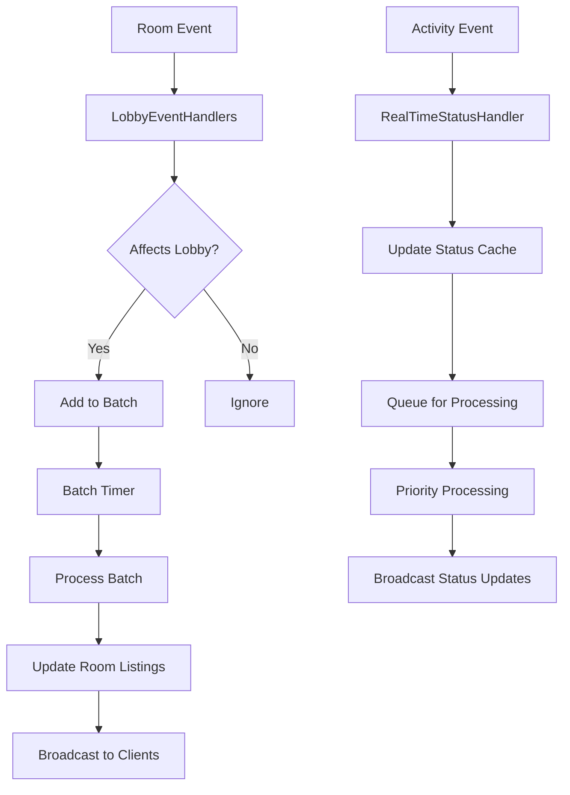

# Lobby Management Event Handlers

This directory contains the event handlers for the lobby management bounded context, implementing efficient room discovery and real-time room status updates without affecting room performance.

## Overview

The lobby management event handlers provide:

1. **Real-time room list updates** - Efficiently handle room creation, updates, and deletion
2. **Room status monitoring** - Track room activity, member counts, and privacy changes
3. **Batched processing** - Optimize performance through intelligent batching and debouncing
4. **Metrics collection** - Gather lobby performance and usage metrics

## Components

### LobbyEventHandlers

Main event handler that processes domain events from other bounded contexts to keep lobby room listings up-to-date.

**Key Features:**
- Batched room updates (1-second batching window, max 50 items per batch)
- Handles room lifecycle events (created, closed, member changes)
- Processes room settings changes that affect lobby visibility
- Publishes lobby-specific events for coordination
- Periodic metrics collection (every 5 minutes)

**Events Handled:**
- `RoomCreated` - New room added to lobby
- `RoomClosed` - Room removed from lobby
- `MemberJoined` - Room member count updated
- `MemberLeft` - Room member count updated
- `OwnershipTransferred` - Room ownership changed
- `RoomSettingsUpdated` - Room settings affecting lobby visibility

### RealTimeRoomStatusHandler

Specialized handler for real-time room status tracking with performance optimizations.

**Key Features:**
- Debounced status updates (2-second processing interval)
- Priority-based processing (high/medium/low priority)
- Status cache with TTL (30-second cache lifetime)
- Queue size limiting (max 100 items)
- Activity score calculation
- Automatic cache cleanup

**Status Types Tracked:**
- Room activity (member joins/leaves, audio start/stop, chat messages)
- Member count changes
- Privacy setting changes
- Room availability status

### LobbyNamespaceHandlers

WebSocket namespace handlers for lobby client interactions (already existing).

## Performance Optimizations

### Batching Strategy

```typescript
// Updates are batched for efficiency
private readonly BATCH_INTERVAL_MS = 1000; // 1 second
private readonly MAX_BATCH_SIZE = 50;

// Batch processing reduces WebSocket emissions
lobbyNamespace.to('lobby_updates').emit('rooms_batch_updated', {
  rooms: batchedUpdates,
  count: batchedUpdates.length,
  timestamp: Date.now()
});
```

### Status Caching

```typescript
// Status cache with TTL prevents excessive processing
private readonly STATUS_CACHE_TTL_MS = 30 * 1000; // 30 seconds

// Smart update detection
private shouldUpdateStatus(currentStatus, newStatus, now): boolean {
  // Only update if significant changes or cache expired
}
```

### Priority Processing

```typescript
// High priority: member joins/leaves, privacy changes
// Medium priority: audio events, chat messages  
// Low priority: minor status updates

// Process high priority updates first
await this.processBatchUpdates(highPriorityUpdates);
await this.processBatchUpdates(mediumPriorityUpdates);
await this.processBatchUpdates(lowPriorityUpdates);
```

## Event Flow



## Usage Examples

### Handling Room Creation

```typescript
// Automatically handled when RoomCreated event is published
const roomCreated = new RoomCreated('room-123', 'user-456', 'My Room', false);
await eventBus.publish(roomCreated);

// Results in batched lobby update after 1 second
```

### Tracking Room Activity

```typescript
// Update room activity status
await realTimeStatusHandler.handleRoomActivityChange(
  'room-123',
  'member_join',
  { memberCount: 4, isOwnerAction: false }
);

// Status is cached and batched for efficient broadcasting
```

### Privacy Changes

```typescript
// Handle privacy setting changes
await realTimeStatusHandler.handlePrivacyChange('room-123', true);

// Immediately publishes RoomLobbyStatusChanged event
// Updates cached status with high priority
```

## Configuration

### Timing Configuration

```typescript
private readonly BATCH_INTERVAL_MS = 1000; // Batch processing interval
private readonly MAX_BATCH_SIZE = 50; // Maximum items per batch
private readonly STATUS_CACHE_TTL_MS = 30 * 1000; // Status cache TTL
private readonly PROCESSING_INTERVAL_MS = 2000; // Status processing interval
private readonly METRICS_INTERVAL_MS = 5 * 60 * 1000; // Metrics collection interval
```

### Performance Limits

```typescript
private readonly MAX_QUEUE_SIZE = 100; // Maximum queued status updates
```

## Monitoring and Metrics

The handlers collect and publish metrics including:

- Average search response times
- Total search count
- Popular genres
- Peak concurrent users
- Room activity distribution
- Cache hit rates
- Batch processing performance

## Error Handling

All handlers implement graceful error handling:

- Failed room lookups don't block other updates
- Invalid status updates are logged but don't crash the system
- Network errors during broadcasting are retried
- Cache corruption is automatically recovered

## Testing

Comprehensive test coverage includes:

- Event handling verification
- Batching behavior validation
- Performance under load
- Error resilience
- Cache management
- Priority processing

Run tests with:
```bash
bun test src/domains/lobby-management/infrastructure/handlers/__tests__/ --run
```

## Requirements Satisfied

This implementation satisfies the following requirements:

- **9.4**: Handle room list updates and real-time room status changes
- **9.6**: Implement efficient room discovery without affecting room performance

The batching, caching, and priority-based processing ensure that lobby operations remain efficient even under high load, while real-time updates keep the lobby information current for users.